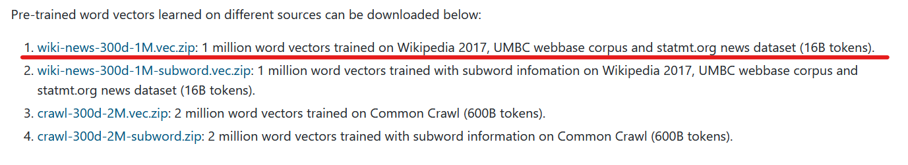

# Lucene Search Engine 

## Description

Lucene Search Engine is an application based on Java's open-source search software Lucene, which provides
capabilities such as index creation and query execution. These operations are combined to create a search
engine that uses user-input keywords to search on a collection of songs that consists of three fields: artist,
song and lyrics. The search can be executed based on all fields or one specific. The results 
are presented based on their relevance to the query (ranking) and are visualized in a graphical user interface
using the JavaFX library. The application also features functions such as keeping search history to similar
searches as the user types and sorting alphabetically the results after the search, based on one of the fields.

## Supported Queries

+ **key-word queries** : to find an exact match for a specific word (ex. holy)
+ **boolean queries** : search matching words with logical operators AND, OR, NOT (ex1. love AND cry, ex2. love NOT cry)
+ **wildcard queries** : search matching words with special characters `+`,`-`,`~`,`*`,`?` (ex1. lo?e, ex2. cry~.2, ex3. +love -cry)
+ **field queries** : search in separate fields like artist, song and lyrics or in all of them with all

## How to Operate

The user can select the search field, with the default being to search in all available fields. 
During program execution, the user inputs a word and clicks the search button. The results are 
displayed at the bottom of the graphical user interface (GUI), with 10 results per page. The results
are sorted by the frequency of appearances in the chosen field. The user can also sort the results 
alphabetically and choose different fields to search in. Additionally, the user can navigate between
pages using the Previous and Next buttons. The search history is displayed on the left, and clicking 
the clear button clears the history.

## How to run

### Step 1
+ To set up the application you first need to download the `archive.zip` file from https://we.tl/t-vycasLeGfH. This
  file contains everything that the application needs to run except for the pre-trained embedding model.

+ The pre-trained model can be found on: https://fasttext.cc/docs/en/english-vectors.html



### Step 2

After you download the files extract both and add the `.vec` file of the embedding to the `embmodel` directory.

### Step 3

To execute the application navigate from the terminal to `search_engine_lucene_jar` directory and use the 
following command: 

```bash
java --module-path "..\javafx-sdk-20.0.1\lib" --add-modules=javafx.base,javafx.controls,javafx.graphics,javafx.media,javafx.web -jar search-engine-lucene.jar "../index" "../embmodel/wiki-news-300d-1M.vec"
```


